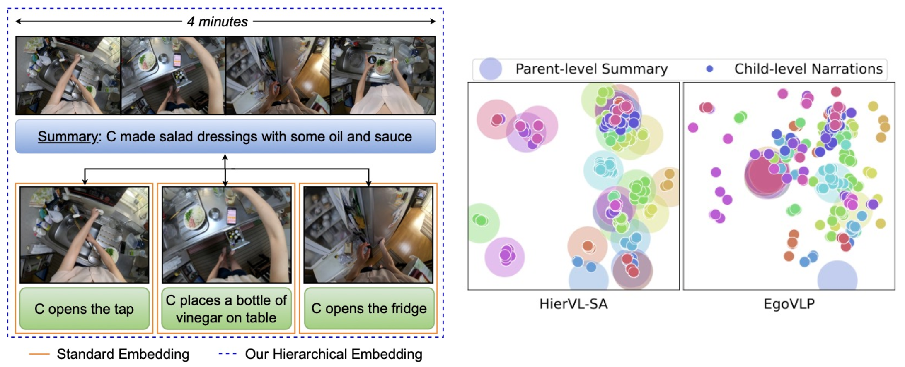

# HierVL: Learning Hierarchical Video-Language Embeddings

Official code of [HierVL: Learning Hierarchical Video-Language Embeddings](https://openaccess.thecvf.com/content/CVPR2023/html/Ashutosh_HierVL_Learning_Hierarchical_Video-Language_Embeddings_CVPR_2023_paper.html), CVPR 2023.

[Project page](https://vision.cs.utexas.edu/projects/hiervl/) | [arXiv](https://arxiv.org/abs/2301.02311)



## Introduction

HierVL is a novel hierarchical video-language embedding that simultaneously accounts for both long-term and short-term associations. We pretrain on Ego4D narrations and summaries and also transfer the representations to Charades-Ego, EPIC-KITCHENS and HowTo100M.

## Installation

To create a conda enviornment with the required dependencies, run the following command:

```bash
conda env create -f environment.yml
source activate hiervl
```

## Dataset Preparation

Please refer to [EgoVLP](https://github.com/showlab/EgoVLP) codebase for data preparation. We use the downsampled and chunked video outputs as the input to our method (output from `utils/video_chunk.py`). For summary sentences, we provide the processed summary and narration hierarchy [here](https://dl.fbaipublicfiles.com/hiervl/summary_clips_hierarchy_full.json). The used `egosummary_full.csv` is available [here](https://dl.fbaipublicfiles.com/hiervl/egosummary_full.csv).

## Setting Correct Paths

All the references to the datasets must be set correctly to run the codes. To help this process, we have replaced all the paths with a suitable string and documented it in [PATHS](PATHS). Use `git grep path` to find all the occurences of that filepath and replace it with your processed path.

## Pretraining

We use four nodes for distributed training. Each node has 32GB GPUs and 480GB CPU memory. The pretraining can be run as

```bash
python -m torch.distributed.launch  --nnodes=$HOST_NUM  --node_rank=$INDEX  --master_addr $CHIEF_IP  --nproc_per_node $HOST_GPU_NUM  --master_port 8081  run/train_egoaggregate.py --config configs/pt/egoaggregation.json
```

We experiment mainly on SLURM and the instructions to run this code on SLURM is given next.

## Running on SLURM cluster

To run the pretraining on a distributed SLURM system, copy the content of `slurm_scripts` to this directly level and run

```
bash mover_trainer.sh job_name
```

The parameters of the SLURM job can be changed in the trainer.sh script. We use 4 nodes each with 32 GB GPUs. The submit schedule first copies the required scripts to a different folder and then runs it from there. This copying ensures the code can be safely edited while a job is in the SLURM queue.

## Pretraining Checkpoint

The pretraining checkpoint is available [here](https://dl.fbaipublicfiles.com/hiervl/hievl_sa.pth).

## Configs for Baseline and Ablations

Change the following flags to run the baselines and ablations
- HierVL-Avg: Change `self-attention` to `average` in `configs/pt/egoaggregation.json`
- HierVL-w/o Joint: Set `catastrophic_forgetting_baseline` to True in `trainer/trainer_egoaggregate.py`.
- HierVL-w/o Hier: Set `append_summary_baseline` to True in `EgoClip_EgoMCQ_dataset.py` and run EgoVLP pretraining.
- HierVL-w/o Summ: Set `only_sa_no_summary_baseline` to True in `trainer/trainer_egoaggregate.py`
- HierVL-w/o Summ <-> Narr: Set `only_video_with_summary_baseline` to True in `trainer/trainer_egoaggregate.py`

## Downstream Task Training

To run the downstream tasks, modify the `trainer.sh` commands with the following flags

- `--experiment charades --config configs/ft/charades.json` for Charages-Ego Action Classification downstream training
- `--experiment epic_mir --config configs/ft/epic.json` for EPIC-KITCHENS-100 MIR downstream training
- `--experiment howto100m --config configs/ft/howto100m.json` for HowTo100M long video classification

## Downstream Task Testing

### Charades-Ego Action Classification

To test the performance, run

```python
python run/test_charades.py
```

Remember to use the released finetuned checkpoint [here](https://dl.fbaipublicfiles.com/hiervl/charades_hievl_sa.pth) or zero-shot checkpoint [here](https://dl.fbaipublicfiles.com/hiervl/hievl_sa_2.pth).

### EPIC-KITCHENS-100 Multi-Instance Retrieval

To test the performance, run

```python
python run/test_epic.py
```

Remember to use the released finetuned checkpoint [here](https://dl.fbaipublicfiles.com/hiervl/epic_hievl_sa.pth) or zero-shot checkpoint [here](https://dl.fbaipublicfiles.com/hiervl/hievl_sa.pth).


## Issues

Please open an issue in this repository (preferred for better visibility) or reach out to [kumar.ashutosh@utexas.edu](mailto:kumar.ashutosh@utexas.edu).

## Contributing

See the [CONTRIBUTING](CONTRIBUTING.md) file for how to help out.

## Citation

If you use the code or the method, please cite the following paper:

```bibtek
@InProceedings{Ashutosh_2023_CVPR,
    author    = {Ashutosh, Kumar and Girdhar, Rohit and Torresani, Lorenzo and Grauman, Kristen},
    title     = {HierVL: Learning Hierarchical Video-Language Embeddings},
    booktitle = {Proceedings of the IEEE/CVF Conference on Computer Vision and Pattern Recognition (CVPR)},
    month     = {June},
    year      = {2023},
    pages     = {23066-23078}
}
```

## Acknowledgement

The pretraining and Chrades-Ego, EPIC-KITCHENS finetuning codebase is based on [EgoVLP](https://github.com/showlab/EgoVLP) repository. Ego4D LTA is based on [Ego4D Baseline Code](https://github.com/EGO4D/forecasting). We thank the authors and maintainers of these codebases.

## License

HierVL is licensed under the [CC-BY-NC license](LICENSE).
